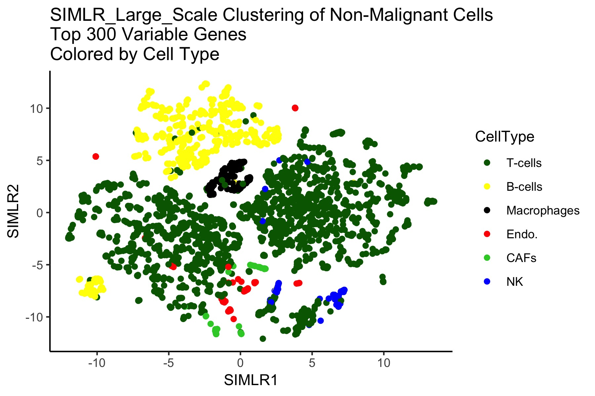

```{r setup, include=FALSE}
knitr::opts_chunk$set(echo = TRUE)
```

# Introduction
This project focuses on replicating aspects of the paper "Dissecting the multicellular ecosystem of metastatic melanoma by single-cell RNA-seq" by Tirosh *et al*. The biological question of interest is the exploration of the distinct genotypic and phenotypic states of melanoma tumors. There is a need for a deeper understanding of melanoma composition and its effect on the clinical course as the cellular composition of each tumor may exert critical roles in cancer development. Furthermore, classification of tumor heterogeneity may inform treatment through immunological or other mechanisms. This is particularly important in tumors with few treatment options, or in cases where tumors are likely to recur.

The paper "used a multistep approach to distinguish the different cell types within melanoma tumors on the basis of both genetic and transcriptional states," which we attempted to replicate. For their first step and one of this project's tasks, large-scale copy number variations (CNVs) were inferred from expression profiles by averaging expression over stretches of 100 genes on their respective chromosomes. For the next task, the cells were grouped according to their expression profiles using t-SNE (nonlinear dimensionality reduction). In addition to t-SNE, we attempted dimensionality reduction using UMAP and clustering with SIMLR. The paper found that in general, "cells designated as malignant by CNV analysis formed a separate cluster for each tumor, suggesting a high degree of intertumor heterogeneity." The non-malignant cells, however, clustered by cell type and not by tumor or metastatic site. 

# The Data
We utilized the publicly available dataset GSE72056 containing 4645 single-cell RNA-seq profiles measured from malignant, immune, and stromal cells, isolated from 19 patients that span a range of clinical and therapeutic backgrounds. For the malignant cells, only tumors with >50 malignant cells were included. The paper included 6 tumors on this basis, but we found 8 tumors satisfying the condition, depending on ordering of filtering criteria. For the non-malignant cells, only tumors with >100 non-malignant cells were included. Using this criteria, the paper included 11 tumors in the main figure while we included 12.

Before beginning the analysis, we used the *Seurat* package to perform quality checks on the data. The 'SCTransform' function scaled the residuals to have unit variance and centered the residuals to have mean zero. However, the data was already pre-processed and using centered and scaled data resulted in worse performance compared to using just centered data. 'SCTransform' was also used to find the top 300 and 3000 variable genes, used to subset the data is later analysis. As will be seen later, using data containing only the 300 most variable genes improved analysis compared to using only the 3000 most variable genes and also compared to using the complete data.

(insert more about data here)

# Task 1
For the first task, we attempted to replicate the following plots using various visualization and clustering methods. Malignant and non-malignant cell-types were distinguished using single-cell expression profiles. Clusters of non-malignant cells are marking by dashed ellipses and were annotated as T cells, B cells, macrophages, endothelial cells, cancer-associated fibroblasts, and natural killer cells.

{width=250px}
{width=305px}

### t-SNE
(description of t-SNE and explain results )
(insert Eric's t-SNE plots)

These steps can be condensed into a single function:

```{r, eval=FALSE}
## For Convenience these steps can be condensed into a single function ####
run_seurat <- function(exprsMatrix){
  ## Create Seurat Object ####
  sobj <- CreateSeuratObject(raw.data = exprsMatrix)
  ## Normalization ####
  sobj <- NormalizeData(sobj, normalization.method = 'LogNormalize', scale.factor = 10000)
  ## Finding Highly Variable Genes ###
  sobj <- FindVariableGenes(sobj,
                            mean.function = ExpMean,
                            dispersion.function = LogVMR,
                            x.low.cutoff = 0.0125,
                            x.high.cutoff = 3,
                            y.cutoff = 0.5)
  ## Scaling data to regress out confounders (detected molecules per cell) ####
  sobj <- ScaleData(sobj, vars.to.regress = c('nUMI'))
  ## Dimensionality Reduction ####
  sobj <- RunPCA(sobj, pc.genes = sobj@var.genes, do.print = T, pcs.print = 1:5, genes.print = 5)
  ## Clustering and tSNE Plot ####
  sobj <- FindClusters(sobj, reduction.type = "pca", dims.use = 1:8, resolution = 1.0, print.output = 0, save.SNN = T)
  sobj <- RunTSNE(sobj, dims.use = 1:8)
  TSNEPlot(sobj)
  return(sobj)
}
```


### UMAP
Uniform Manifold Approximation and Project (*UMAP*) is a novel manifold learning technique for dimension reduction competitive with *t-SNE* for data visualization. Before running *UMAP*, linear dimensional reduction (principal components analysis) was performed. Then UMAP was run on both the untransformed complete data, and on the centered data containing only the 300 and 3000 most highly variable genes. In the UMAP plots below, it can be seen that the malignant cells cluster by tumor origin. In all three cases, distinct clustering can be seen, although in varying degrees. Arguably, *t-SNE* performs the best in terms of creating distinct separation between clusters. In the *t-SNE* plot, the non-malignant cells appeared to cluster by cell-type. This is somewhat the case for UMAP run on the centered data using the top 300 most variable genes. However, the T cells form two separate clusters, while some of the other cell-types are lost within the T cells. For UMAP run on the complete data and on the top 3000 most variable genes, one does not observe clustering by cell-type. Clustering by tumor is not apparent either.

{width=400px}
{width=400px}
{width=400px}


{width=400px}
{width=400px}

{width=400px}
{width=400px}

{width=400px}
{width=400px}

### SIMLR
Single-cell Interpretaion via Multi-kernal LeaRning (*SIMLR*) is a similarity-learning frameowrk that learns an appropriate distance metric from the data for purposes of dimension reduction, clustering, and visualization. *SIMLR* and *SIMLR* large scale was run on the transformed data using only the 300 most variable genes. The normalized mutual information (NMI) was computed between the clusters inferred by *SIMLR* large scale and the ground truth clusters. NMI scores range from 0 and 1, with higher values reflecting better performance. Again, in the *t-SNE* plots, malignant cells cluster by tumor origin. The same is true for clusters identified by *SIMLR*. The clusters found by *SIMLR* (NMI=0.6077) are well-separated but a few tumors were clustered together, as can be seen below. *SIMLR* large scale performed much better than *SIMLR* (NMI=0.8518) in clustering the malignant cells. *SIMLR* had the worst performance in clustering the non-malignant cells (NMI=0.5708). As in *UMAP*, *SIMLR* created two clusters for T cells while other cell-types were lost within the T cells. There is some clustering by cell-type, but it is not as apparent as in the *t-SNE* plots, and clustering by tumor is not apparent either.


{width=400px}
{width=400px}

{width=400px}
{width=400px}

{width=400px}
{width=400px}

{width=400px}

# Task 2
For the second task, we attempted to replicate the following plot using *InferCNV*.

Copy number variations (CNVs) are genomic alterations, with abnormal deletions or amplifications of one or more gens on segments of chromosomes. And InferCNV is applied to explore the tumor single cell RNA-seq data, detect chromosomal copy number alterations and identify deletions or amplifications of malignant cell gene expression by comparing it to a set of non-malignant cells.

A heatmap is generated directly from the *InferCNV*, illustrating the relative expression intensities across each chromosome. From the plot, it’s apparent to see which regions of the tumor genome are over-abundant or less-abundant as compared to that of non-malignant cells.

Advanced application of *InferCNV* also includes methods to predict CNA regions and define cell subclusters according to patterns of heterogeneity, and you can run it step by step for more exploratory purposes, which is not included in this report. Here we just use the standard pipeline to replicate the figure in paper and compare the results. 

Use non-malignant cells as reference cells for Mel80:

{width=400px}


If we do not indicate reference cells, the average signal across all cells will be used to define the baseline:

{width=400px}


We also try to plot heatmap for Mel78 as showed in supplementary materials:


{width=400px}

Plot caption: Chromosomal landscape of inferred large-scale CNVs allows us to distingush malignant from non-malignant cells. The Mel80 tumor is shown with individual cells (y axis) and chromosomal regions (x axis). Amplifications (red) or deletions (blue) were inferred by averaging expression over 100-gene stretches on the respective chromosomes. Inferred CNVs are concordant with calls from WES.

# Discussion


# References


